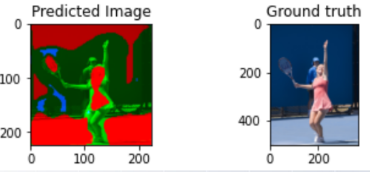
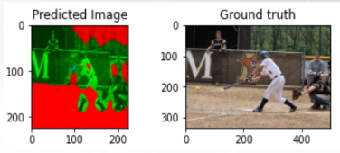
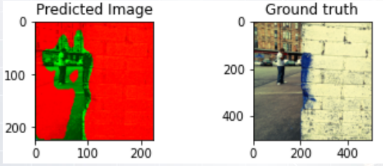
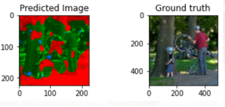
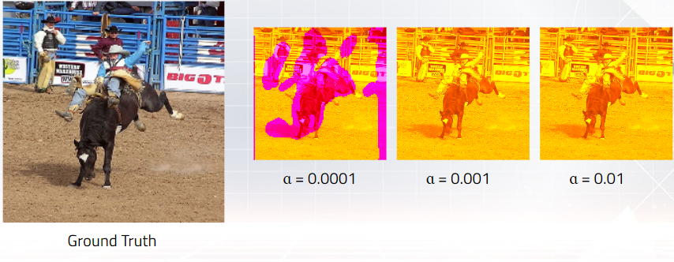

# MAIS202 Fall 2022 Final Project: Colourizing Greyscale Images
<h2> Abstract </h2>

This repository contains all the source code developed throughout the semester. 

<h2> Repository Structure </h2>

- Code
  - Archive (old code that I refused to toss)
  - Practice
  - <b> MAIS202_Image_Colorization.ipynb </b>
- Deliverables
- Images
- Models

<h2> Dataset </h2>

Our dataset consisted of 30K 224x224 pixel images from 

<h2> Sample Output </h2>

<h2> Final Reflection </h2>

The model did not perform very well! :D Several improvements can be made. The main goal moving forward is to finetune a pre-trained model as opposed to training a model from scratch. Other improvements include proper handling when dealing with images in Python.

<h2> References </h2>

- https://algoritmaonline.com/image-colorization/
- https://xiangyutang2.github.io/auto-colorization-autoencoders/
- https://medium.com/@navmcgill/k-fold-cross-validation-in-keras-convolutional-neural-networks-835bed559d04

<h2>Post-Bootcamp To-Dp:</h2>

- Reorganize repo
- Develop proper script to handle incoming images
- Search for more appropriate dataset (consistent image set?)
- Finetune a pre-trained model
- Develop a platform to interact with model
